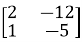
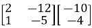
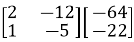
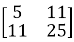
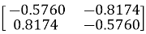
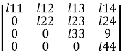
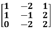

<!DOCTYPE html>
<html lang="en">
<head>
  <meta charset="UTF-8">
  <meta name="viewport" content="width=device-width, initial-scale=1.0">
  <link href="https://cdn.jsdelivr.net/npm/tailwindcss@2.2.19/dist/tailwind.min.css" rel="stylesheet">
<!-- MathJax v3 CDN -->

</head>
<body>
      

        

In signal processing, basic matrices play crucial roles in various operations, forming the backbone of many algorithms and techniques. The identity matrix, a specific type of diagonal matrix, serves as a neutral element in matrix multiplication, crucial for preserving original signal values during transformations. Diagonal matrices streamline computations by allowing for independent scaling of signal components. Singular Value Decomposition (SVD) is a powerful tool in signal processing, extensively applied in noise reduction, data compression, and system identification. Matrix multiplication is fundamental in filtering, convolution, and applying linear transformations to signals, with convolution matrices specifically used to represent the effect of filters or kernels on signals.

        
The Fourier matrix is essential for converting signals between time and frequency domains in signal processing. Transposition is used in forming cross-correlation matrices and working with orthogonal bases, like in PCA. Determinants help analyze system stability and calculate volumes in multivariate Gaussian distributions, while eigenvalue decomposition simplifies the representation of systems and signal energy distribution.

        
LU decomposition is essential for solving linear equations, inverting matrices, and computing determinants. In signal processing, linear equations are crucial for various tasks, including filter design, system identification, and signal reconstruction. They are used to model and solve problems such as noise reduction, linear filtering, and Fourier transforms. Linear systems also underpin techniques like Principal Component Analysis (PCA) and Kalman filtering for estimation and prediction. Essentially, they provide the mathematical framework for manipulating and analyzing signals efficiently.

        
Row echelon form is a fundamental tool in linear algebra that supports various signal processing applications by simplifying the analysis and solution of linear systems, determining matrix rank, etc.

        
These foundational matrices enable efficient computation, representation, and manipulation of signals, serving as the building blocks for more complex signal processing tasks.

        

  
# **Properties of Matrix Operations**

---

## **Properties of Matrix Addition**

The fundamental properties of real number addition also apply to matrices.

Let \( A \), \( B \), and \( C \) be \( m \times n \) matrices:

1. **Commutative Property**:  
   \( A + B = B + A \)

2. **Associative Property**:  
   \( A + (B + C) = (A + B) + C \)

3. **Additive Identity**:  
   There exists a unique \( m \times n \) zero matrix \( O \) such that  
   \( A + O = A \)

4. **Additive Inverse**:  
   For every \( m \times n \) matrix \( A \), there exists a matrix \( -A \) such that  
   \( A + (-A) = O \)

---

## **Properties of Matrix Multiplication**

Unlike addition, not all multiplication properties of real numbers apply to matrices. In general:

- Matrix multiplication is **not commutative**:  
  Even if both \( AB \) and \( BA \) are defined, they may not be equal.
- A matrix may not have a **multiplicative inverse**, even if it is square.

However, some properties **do generalize**.  
Let \( A \), \( B \), and \( C \) be matrices such that the following operations are defined:

1. **Associative Property**:  
   \( A(BC) = (AB)C \)

2. **Left Distributive Property**:  
   \( A(B + C) = AB + AC \)

3. **Right Distributive Property**:  
   \( (A + B)C = AC + BC \)

4. **Multiplicative Identity**:  
   There exist identity matrices \( I_m \) and \( I_n \) such that:  
   \( I_m A = A \) and \( A I_n = A \)

---

## **Properties of Scalar Multiplication**

When multiplying matrices by scalars, all properties of scalar multiplication for real numbers apply.

Let \( r \) and \( s \) be real numbers, and \( A \) and \( B \) be matrices:

1. \( r(sA) = (rs)A \)

2. \( (r + s)A = rA + sA \)

3. \( r(A + B) = rA + rB \)

4. \( A(rB) = r(AB) = (rA)B \)  
   *(if multiplication is defined)*

---

## **Properties of the Transpose of a Matrix**

The **transpose** of a matrix is obtained by switching its rows and columns.

Let \( r \) be a real number, and \( A \), \( B \) be matrices:

1. \( (A^T)^T = A \)

2. \( (A + B)^T = A^T + B^T \)

3. \( (AB)^T = B^T A^T \)

4. \( (rA)^T = rA^T \)

---

## **Properties of Determinants**

1. \( \det(A) = \det(A^T) \)

2. If any row or column is multiplied by a scalar \( k \), then:  
   \[
   \det(\Delta') = k \cdot \det(\Delta)
   \]

3. If all elements in any row or column are zero, then the determinant is zero.

4. If a matrix is **upper or lower triangular**, i.e., all elements above or below the diagonal are zero, then the determinant equals the **product of the diagonal elements**.

# **Matrix Theory: Minor, Cofactor, Adjoint, and Inverse**

---

## **Matrix Multiplication Representation**

Given two matrices:  
- \( [A]_{i \times k} \)  
- \( [B]_{k \times j} \)  

Their product is:  
\[
[A]_{i \times k} \cdot [B]_{k \times j} = [C]_{i \times j}
\]  
Where each element of the resulting matrix \( C \) is given by:  
\[
c_{ij} = \sum_{k} a_{ik} \cdot b_{kj}
\]

The **transpose** of matrix \( C \) is:  
\[
C^T = [C]_{j \times i} = [C]_{ji}
\]

Where \( C^T \) denotes the transpose of matrix \( C \).

---

## **1. Transpose of a Product of Matrices**

### **1.a)**  
\[
(A \cdot B)^T = B^T \cdot A^T
\]

Proof:  
\[
(A \cdot B)^T_{ij} = (A \cdot B)_{ji} = \sum_k a_{jk} b_{ki} = \sum_k b^T_{ik} a^T_{kj} = (B^T \cdot A^T)_{ij}
\]

### **1.b)**  
\[
B^T \cdot A^T = (A \cdot B)^T
\]

Proof (reverse direction):  
\[
(B^T \cdot A^T)_{ij} = \sum_k b^T_{ik} \cdot a^T_{kj} = \sum_k b_{ki} \cdot a_{jk} = (A \cdot B)_{ji} = (A \cdot B)^T_{ij}
\]

---

## **2. Cofactor and Adjoint of a Matrix**

### **Cofactor Matrix of A**

The cofactor matrix \( \text{CO}_{ij} \) is defined as:  
\[
\text{CO}_{ij} = (-1)^{i+j} \cdot M_{ij}
\]  
Where \( M_{ij} \) is the **minor** of element \( a_{ij} \) — the determinant of the matrix formed by deleting the \( i^\text{th} \) row and \( j^\text{th} \) column from matrix \( A \).

### **Adjoint of A**

The adjoint of matrix \( A \), denoted as \( \text{Adj}(A) \), is the **transpose of the cofactor matrix**:  
\[
\text{Adj}(A) = [\text{CO}_{ij}]^T
\]

---

## **3. Inverse of a Matrix**

If matrix \( A \) is square and invertible, its inverse is given by:  
\[
A^{-1} = \frac{\text{Adj}(A)}{\det(A)}
\]  
Where \( \det(A) \) is the determinant of \( A \).

---

## **4. Inverse of a Product of Matrices**

Let \( A \) and \( B \) be invertible square matrices of size \( n \times n \). Then:  
\[
(AB)^{-1} = B^{-1} A^{-1}
\]

**Proof Sketch**:

Start from:  
\[
(AB)(AB)^{-1} = I
\]

Pre-multiply both sides by \( A^{-1} \):  
\[
A^{-1} (AB)(AB)^{-1} = A^{-1} I
\Rightarrow B(AB)^{-1} = A^{-1}
\]

Now pre-multiply both sides by \( B^{-1} \):  
\[
B^{-1} B(AB)^{-1} = B^{-1} A^{-1}
\Rightarrow (AB)^{-1} = B^{-1} A^{-1}
\]

---

## **5. Adjoint of a Product**

\[
\text{Adj}(AB) = \text{Adj}(B) \cdot \text{Adj}(A)
\]

**Proof Sketch**:

From inverse definition:
\[
(AB)^{-1} = \frac{\text{Adj}(AB)}{\det(AB)}
\Rightarrow \text{Adj}(AB) = (AB)^{-1} \cdot \det(AB) \tag{1}
\]

Also,  
\[
(AB)^{-1} = B^{-1} A^{-1}, \quad \det(AB) = \det(A) \cdot \det(B) \tag{2}
\]

Now use the definition of adjoint:  
\[
A^{-1} = \frac{\text{Adj}(A)}{\det(A)}, \quad B^{-1} = \frac{\text{Adj}(B)}{\det(B)} \Rightarrow
\]

\[
\text{Adj}(A) = A^{-1} \cdot \det(A), \quad \text{Adj}(B) = B^{-1} \cdot \det(B)
\]

Therefore,  
\[
\text{Adj}(B) \cdot \text{Adj}(A) = \det(A) \cdot \det(B) \cdot B^{-1} \cdot A^{-1} \tag{3}
\]

Substitute (2) into (1):  
\[
\text{Adj}(AB) = \det(A) \cdot \det(B) \cdot B^{-1} \cdot A^{-1} \tag{4}
\]

From (3) and (4):  
\[
\text{Adj}(AB) = \text{Adj}(B) \cdot \text{Adj}(A)
\]

				<strong>Eigenvalue and Eigenvector</strong>
			

			

				Let’s assume a square matrix <strong>A</strong>
			

			

				The characteristic equation,
			

			

				<strong>| A – </strong>λ*<strong>I | = </strong>0&#xa0;&#xa0; 
			

			

				<em>(where </em><strong><em>I </em></strong><em>is an identity matrix)</em>
			

			

				After calculating the values of λs we attempt to find eigenvectors for corresponding eigenvalues like this
			

			

				For eigenvalue, λ = λ1
			

			

				<strong>A*x</strong> = λ1*<strong>I*x</strong><strong>&#xa0;&#xa0; </strong><em>(where, </em><strong><em>x</em></strong><em> is an unknown vector)</em>
			

			

				Or, (<strong>A</strong> - λ1*<strong>I</strong>)*<strong>x</strong> = 0
			

			

				The value of <strong>x </strong>is the corresponding eigenvector of λ1
			

			

				&#xa0;
			

			

				<strong>Power Method for Dominant Eigenvalue</strong>
			

			

				Let λ1, λ2, λ3, and λn be the eigenvalues of an <strong>n X n </strong>matrix <strong>A</strong>.&#xa0; λ1 is called the dominant eigenvalue of <strong>A</strong> if
			

			

				| λ1| &gt; | λi |,&#xa0;&#xa0; <em>i = 2, 3, ... , n</em>
			

			

				The eigenvectors corresponding to λ1 are called dominant eigenvectors of <strong>A</strong>.
			

			

				&#xa0;
			

			

				<strong>Example</strong>
			

			

				A = 
			

			

				&#xa0;
			

			

				We begin with an initial nonzero approximation of
			

			

				<strong>x</strong><strong>0</strong> = 
			

			

				&#xa0;
			

			

				We then obtain the following approximations
			

			

				<strong>x</strong><strong>1</strong><strong> = Ax</strong><strong>0 </strong><strong>= </strong> =  = -4
			

			

				<strong>&#xa0;</strong>
			

			

				<strong>x</strong><strong>2</strong><strong> = Ax</strong><strong>1 </strong><strong>= </strong> =  = 10
			

			

				<strong>x</strong><strong>3</strong><strong> = Ax</strong><strong>2 </strong><strong>= </strong> =  = -22
			

			

				&#xa0;
			

			

				<strong>x</strong><strong>4</strong><strong> = Ax</strong><strong>3 </strong><strong>= </strong> =  = 46
			

			

				&#xa0;
			

			

				<strong>x</strong><strong>5</strong><strong> = Ax</strong><strong>4 </strong><strong>= </strong> =  = -94
			

			

				<strong>x</strong><strong>6</strong><strong> = Ax</strong><strong>5 </strong><strong>= </strong> =  = 190
			

			

				&#xa0;
			

			

				Note that the approximations in Example appear to be approaching scalar multiples of 
			

			

				So, the obtained dominant eigenvector from the above iterations is
			

			

				<strong>x</strong> = 
			

			

				&#xa0;
			

			

				Now, we’ll find the corresponding eigenvalue from the obtained eigenvector
			

			

				&#xa0;
			

			

				<strong>Formula</strong>
			

			

				If <strong>x </strong>is an eigenvector of <strong>A</strong>, then its corresponding eigenvalue is given by 
			

			

				&#xa0;
			

			

				λ = (<strong>Ax.x / x.x</strong>)
			

			

				<strong>Ax </strong>=  = 
			

			

				Then, <strong>Ax.x = </strong> = -20.0 (approx.)
			

			

				And <strong>x.x </strong>=  =  = 9.94 (approx.)
			

			

				So, the corresponding eigenvalue, λ = (-20.0 / 9.94) = -2 (approx.)
			

			

				&#xa0;
			

			

				<strong>Singular Value Decomposition (SVD)</strong>
			

			

				<strong>Theory:</strong>
			

			

				Singular Value Decomposition (SVD) is a matrix factorization technique that decomposes any m×n matrix A into three matrices: A=UΣVT 
			

			

				Where:
			

			<ul>
				<li>
					U is an m×m orthogonal matrix (or unitary if complex).
				</li>
				<li>
					Σ is m×n diagonal matrix with non-negative real numbers on the diagonal (singular values).
				</li>
				<li>
					VT is an n×n orthogonal matrix (or unitary if complex), and VT is the transpose of V.
				</li>
			</ul>
			

				<strong>Example</strong>
			

			

				A = 
			

			

				&#xa0;
			

			

				Compute ATA and AAT
			

			

				&#xa0;
			

			

				ATA =  = 
			

			

				&#xa0;
			

			

				AAT =  = 
			

			

				&#xa0;
			

			

				<strong>Find Eigenvalues and Eigenvectors</strong>:
			

			

				For ATA:
			

			<ul>
				<li>
					Eigenvalues are λ1= 29.8661 and λ2 = 0.1339
				</li>
				<li>
					Corresponding eigenvectors (normalized) are v1 = and v2 = 
				</li>
			</ul>
			

				For AAT:
			

			<ul>
				<li>
					Eigenvalues are λ1= 29.8661 and λ2 = 0.1339
				</li>
				<li>
					Corresponding eigenvectors (normalized) are u1 = and u2 = 
				</li>
			</ul>
			

				&#xa0;
			

			

				<strong>Compute Singular Values</strong>:
			

			

				Singular values are σ1 = √ 29.8661= 5.4650
			

			

				And σ1 = √ 0.1339 = 0.3660
			

			

				&#xa0;
			

			

				<strong>Final SVD:</strong>
			

			

				A=UΣVT
			

			

				Where: 
			

			

				U = &#xa0; Σ = &#xa0; 
			

			

				VT = 
			

			

				&#xa0;
			

			

				<strong>LU Decomposition</strong>
			

			

				LU Decomposition is a method to find solutions of linear equations.
			

			

				&#xa0;
			

			

				Using Gauss Elimination Method 
			

			

				&#xa0;
			

			

				Consider a matrix&#xa0;𝐴. If all entries below the diagonal entries are zero, then the matrix is called “upper triangular.” If all entries above the diagonal entries are zero, then the matrix is called “lower triangular.” 
			

			

				&#xa0;&#xa0;&#xa0;&#xa0;&#xa0;&#xa0;&#xa0;&#xa0; And <strong>A = L*U</strong>
			

			

				<strong>L</strong> =&#xa0; ;&#xa0;&#xa0; <strong>U</strong> = 
			

			

				&#xa0;
			

			

				<strong><em>L= lower triangular matrix; U= upper triangular matrix</em></strong>
			

			

				&#xa0;
			

			<ol start="5">
				<li>
					For a given matrix
				</li>
			</ol>
			

				<strong>A</strong> = 
			

			

				&#xa0;
			

			

				<strong>A=L*U</strong>
			

			

				Or, <strong>A</strong>=* 
			

			

				&#xa0;
			

			

				<strong><em>L= lower triangular matrix; U= upper triangular matrix</em></strong>
			

			

				&#xa0;
			

			

				After doing the row&#xa0;operation "R2 - (-2)*R1," we get,
			

			

				&#xa0;
			

			

				Or, <strong>A</strong> = * 
			

			

				&#xa0;
			

			

				After row operation in matrix <strong>U</strong>, we've set (-2) to the same place of the<strong> L</strong> matrix and the (2, 1)th position of the U matrix, which is now zero.
			

			

				Firstly, try the first column elements of matrix <strong>U</strong> below diagonal elements to make zeroes,
			

			

				&#xa0;
			

			

				After doing,&#xa0;&#xa0;&#xa0;&#xa0;&#xa0;&#xa0;&#xa0;&#xa0;&#xa0; ‘R2-(-2)*R1’ <em>(as demonstrated above)</em>
			

			

				&#xa0;&#xa0;&#xa0;&#xa0;&#xa0;&#xa0;&#xa0;&#xa0;&#xa0;&#xa0;&#xa0;&#xa0;&#xa0;&#xa0;&#xa0;&#xa0;&#xa0;&#xa0;&#xa0;&#xa0;&#xa0;&#xa0;&#xa0;&#xa0;&#xa0;&#xa0;&#xa0;&#xa0;&#xa0; ‘R3-(3)*R1’ and
			

			

				&#xa0;&#xa0;&#xa0;&#xa0;&#xa0;&#xa0;&#xa0;&#xa0;&#xa0;&#xa0;&#xa0;&#xa0;&#xa0;&#xa0;&#xa0;&#xa0;&#xa0;&#xa0;&#xa0;&#xa0;&#xa0;&#xa0;&#xa0;&#xa0;&#xa0;&#xa0;&#xa0;&#xa0;&#xa0; ‘R4-(2)*R1’
			

			

				We get,
			

			

				&#xa0;
			

			

				<strong>A</strong> = * 
			

			

				&#xa0;
			

			

				In a same way, we will now employ row operations to set the elements of the second column of matrix <strong>U</strong> to zero.
			

			

				&#xa0;
			

			

				Calculate,&#xa0;&#xa0;&#xa0; ‘R3-(-4)*R2’ and
			

			

				&#xa0;&#xa0;&#xa0;&#xa0;&#xa0;&#xa0;&#xa0;&#xa0;&#xa0;&#xa0;&#xa0;&#xa0;&#xa0;&#xa0;&#xa0;&#xa0;&#xa0;&#xa0;&#xa0; ‘R4-(1)*R2’
			

			

				&#xa0;
			

			

				We get,
			

			

				<strong>A</strong> = * 
			

			

				&#xa0;
			

			

				Now, we'll apply row operations to convert the elements of the third column of matrix <strong>U</strong> to zeroes.
			

			

				&#xa0;
			

			

				Now calculate "R4-(3)*R2"
			

			

				We get,
			

			

				&#xa0;
			

			

				<strong>A</strong> = * 
			

			

				&#xa0;
			

			

				So, 
			

			

				&#xa0;
			

			

				<strong>L</strong> = 
			

			

				&#xa0;
			

			

				<strong>U</strong> = 
			

			

				&#xa0;
			

			<ol start="6">
				<li>
					<strong>Before showing the final result, all intermediate steps must be displayed.</strong>
				</li>
			</ol>
			

				&#xa0;
			

			

				<strong>Row Echelon Form</strong>
			

			

				A matrix is in row echelon form if
			

			<ul>
				<li>
					All rows consisting of only zeroes are at the bottom.
				</li>
				<li>
					The leading entry (that is the left-most nonzero entry) of every nonzero row is to the right of the leading entry of every row above
				</li>
				<li>
					Some texts add the condition that the leading coefficient must be 1 while others regard this as reduced row echelon form
				</li>
				<li>
					These two conditions imply that all entries in a column below a leading coefficient are zeros
				</li>
			</ul>
			

				&#xa0;
			

			

				<strong>Procedure</strong>
			

			<ol>
				<li>
					Choose an m X n matrix
				</li>
				<li>
					All zero rows are at the bottom. 
				</li>
				<li>
					Choose the leading entry in the first non-zero row and swap it with the first row if necessary. Or, the leading entry/element in the first row must be non-zero.
				</li>
				<li>
					Divide the first row by the leading entry so that the leading entry becomes 1.
				</li>
				<li>
					Use row operations to make all entries in the first column below the leading entry equal to 0.
				</li>
				<li>
					Repeat steps 3 through 5 for each subsequent row, working from top to bottom.
				</li>
			</ol>
			

				&#xa0;
			

			

				These conditions also imply that all entries in a column below a leading coefficient are zeros
			

			

				&#xa0;
			

			

				<strong>Example</strong>
			

			

				Given matrix,
			

			

				<strong>A = </strong>
			

			

				&#xa0;
			

			

				R2 ← R2 – R1
			

			

				
			

			

				<strong>&#xa0;</strong>
			

			

				R3 ← R3 + 2*R2
			

			

				
			

			

				<strong>&#xa0;</strong>
			

			

				R3 ← R3 / 4
			

			

				
			

			

				&#xa0;
			

			

				<strong>Reduced Row Echelon Form (RREF)</strong>
			

			

				<strong>Procedure</strong>
			

			<ol>
				<li>
					Choose an m X n matrix
				</li>
				<li>
					All zero rows are at the bottom. 
				</li>
				<li>
					Choose the leading entry in the first non-zero row and swap it with the first row if necessary.
				</li>
				<li>
					Divide the first row by the leading entry so that the leading entry becomes 1.
				</li>
				<li>
					Use row operations to make all entries in the first column above and below the leading entry equal to 0.
				</li>
				<li>
					Repeat steps 3 through 5 for each subsequent row, working from top to bottom.
				</li>
				<li>
					After all, rows have been processed, the matrix is in reduced row echelon form.
				</li>
			</ol>
			

				&#xa0;
			

			

				<strong>Example:</strong>
			

			

				Given matrix <strong>A </strong>= 
			

			

				&#xa0;
			

			

				R2 ← R2 – 2*R1 <em>(R1 denotes row 1 and so on)</em>
			

			

				
			

			

				&#xa0;
			

			

				R3 ← R3 – 3*R1
			

			

				
			

			

				&#xa0;
			

			

				&#xa0;
			

			

				R1 ← R1 – 2*R2
			

			

				
			

			

				&#xa0;
			

			

				R1 ← R1 – R3
			

			

				
			

			

				&#xa0;
			

			

				R2 ← R2 – R3
			

			

				
			

			

				&#xa0;
			

			

				<strong>Rank of a Matrix</strong>
			

			

				<strong>Theory:</strong>
			

			

				<strong>Definition</strong>: The rank of a matrix is defined as the maximum number of linearly independent rows (or columns) in the matrix. It can also be seen as the dimension of the row space or column space of the matrix.
			

			

				&#xa0;
			

			

				<strong>Rank of a Matrix in Row Echelon Form (REF)</strong>
			

			<ol>
				<li>
					<strong>Row Echelon Form (REF)</strong>: A matrix is in row echelon form when:
					<ul>
						<li>
							All non-zero rows are above any rows of all zeros.
						</li>
						<li>
							The leading entry (pivot) of each non-zero row is to the right of the leading entry of the row above it.
						</li>
						<li>
							All entries below a pivot are zero.
						</li>
					</ul>
				</li>
			</ol>
			

				&#xa0;
			

			<ol start="2">
				<li>
					<strong>Finding the Rank</strong>:
					<ul>
						<li>
							<strong>Identify Non-Zero Rows</strong>: In REF, the rank of the matrix is equal to the number of non-zero rows. This is because each non-zero row represents a linearly independent vector in the row space of the matrix.
						</li>
						<li>
							<strong>Process</strong>: Convert the matrix to REF using row operations (row swapping, scaling rows, adding/subtracting multiples of rows) and count the number of non-zero rows to determine the rank.
						</li>
					</ul>
				</li>
			</ol>
			

				&#xa0;
			

			

				<strong>Rank of a Matrix in Reduced Row Echelon Form (RREF)</strong>
			

			

				<strong>Theory:</strong>
			

			<ol>
				<li>
					<strong>Reduced Row Echelon Form (RREF)</strong>: A matrix is in reduced row echelon form when:
					<ul>
						<li>
							It is in row echelon form (REF).
						</li>
						<li>
							Each leading entry (pivot) is 1.
						</li>
						<li>
							Each leading 1 is the only non-zero entry in its column.
						</li>
						<li>
							All rows with leading 1s are above rows of all zeros.
						</li>
					</ul>
				</li>
			</ol>
			

				&#xa0;
			

			<ol start="2">
				<li>
					<strong>Finding the Rank</strong>:
					<ul>
						<li>
							<strong>Count Leading 1s</strong>: In RREF, the rank of the matrix is equal to the number of leading 1s. Each leading 1 represents a pivot position in a linearly independent row.
						</li>
						<li>
							<strong>Process</strong>: Convert the matrix to RREF using row operations (pivoting, scaling, and clearing entries above and below pivots) and count the number of leading 1s to determine the rank.
						</li>
					</ul>
				</li>
			</ol>
 
</body>
</html>
